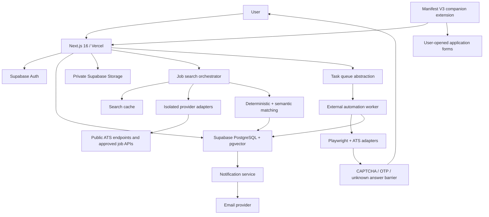
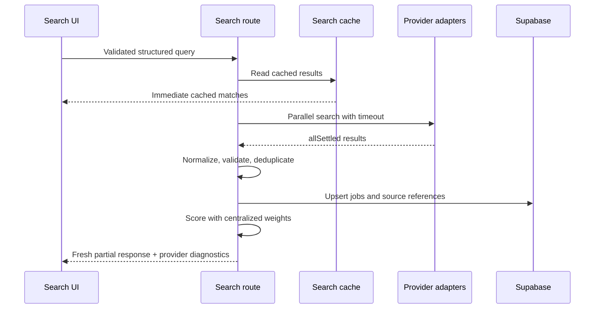
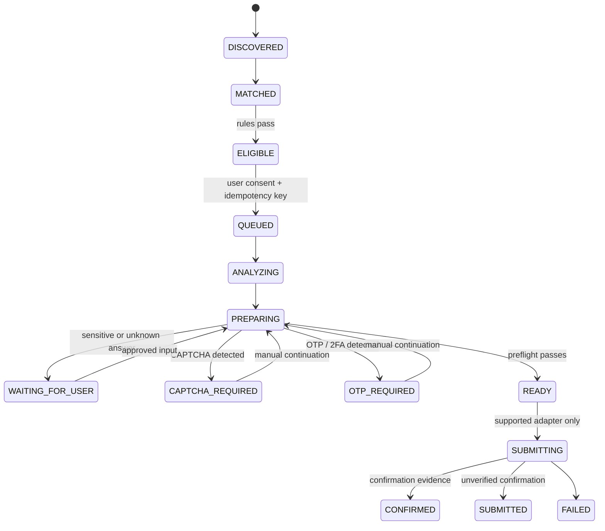

# JobHunter AI architecture

## Design goals

JobHunter AI is a privacy-first job discovery and application workspace. The system favors correctness, user control, and truthful data over application volume. Every automated action is gated by explicit consent, risk checks, idempotency, and an auditable state transition.

## Production topology



## Request boundaries

- Vercel runs the Next.js application, server components, route handlers, server actions, cron orchestration, and short-lived provider requests.
- Supabase is the authoritative store for identity, relational data, vectors, audit events, notifications, and private documents.
- Heavy or persistent browser automation never runs inside a normal Vercel request. It runs in a separately deployed worker reached through the queue abstraction.
- The browser extension is the preferred fallback when remote automation is unsupported or inappropriate.
- Missing credentials do not disable local development. Mock providers are clearly labeled and never mixed with production results.

## Core modules

```text
app/                         Next.js routes and route handlers
src/components/              reusable UI and product shells
src/config/                  feature flags, limits, matching weights
src/lib/ai/                  vendor-neutral AI interfaces and adapters
src/lib/auth/                authorization helpers
src/lib/database/            Supabase clients and repository boundaries
src/lib/jobs/                search, normalization, freshness, deduplication
src/lib/matching/            deterministic and semantic match scoring
src/lib/applications/        field mapping, preflight, risk, state machine
src/lib/automation/          eligibility, simulation, kill switch, queue
src/lib/notifications/       provider abstraction and deduplication
src/lib/observability/       structured safe logging and timings
src/lib/security/            validation, rate limits, safe URLs
src/types/                   shared contracts
supabase/migrations/         complete versioned PostgreSQL schema and RLS
worker/                      isolated Playwright worker foundation
extension/                   Manifest V3 assisted-apply extension
tests/                       unit, integration, and end-to-end coverage
docs/                        operating and engineering documentation
```

## Search flow



Arbeitnow is the default public production adapter and supplies hourly refreshed European and UK listings aggregated from several public ATS sources. Results are cached for one hour, attributed, and linked to the supplied listing. Remotive remains an opt-in remote-only source whose public feed is delayed by 24 hours. No provider is described as real-time unless its own contract guarantees that behavior.

## Application safety flow



Sensitive facts—work authorization, visa status, legal declarations, demographic data, salary, security clearance, and nationality—are never inferred. Unknown critical data produces `ACTION_REQUIRED` or `BLOCKED`. Auto Apply is off by default and simulation mode is required before it can be enabled.

## Data ownership and security

- Every user-owned table carries `user_id` and has row-level security based on `auth.uid()`.
- Shared job records are readable to authenticated users; private feedback, searches, saves, matches, applications, documents, and notifications are user-scoped.
- CV files and optional screenshots live in private buckets. Signed URLs are short-lived and only generated after ownership checks.
- The service-role key is server-only. Browser code receives only the Supabase URL and publishable/anon key.
- Audit and application event payloads are allowlisted metadata. Full CVs, credentials, tokens, and sensitive answers are never logged.
- Critical writes use unique constraints or idempotency keys to prevent duplicate alerts, imports, tasks, and submissions.

## Environments and deployment

- Development uses mock AI, mock applications, and mock jobs unless a provider is explicitly enabled.
- Staging uses isolated Supabase, email sandboxing, worker dry-run, and no employer submissions.
- Production uses separate Supabase and worker resources, Vercel-managed secrets, verified cron calls, and the global Auto Apply kill switch.

The web application remains useful when AI, email, external providers, or the worker are unavailable. Health checks report only coarse component status and never disclose infrastructure details.
